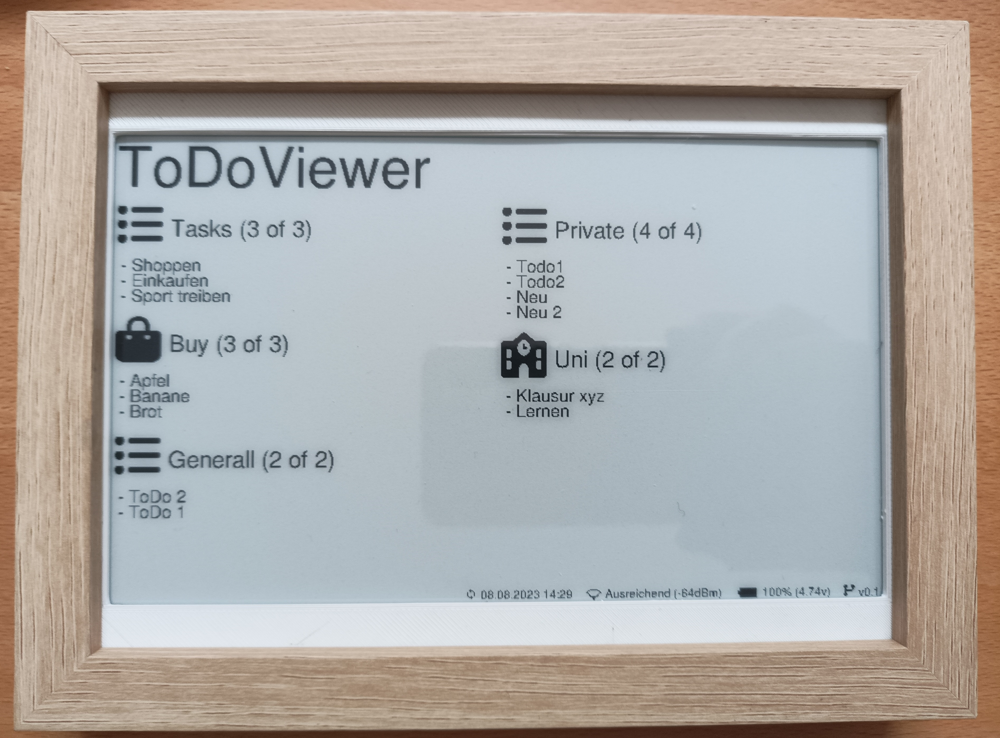

# ESP-ToDoViewer-MSToDo

>  **_NOTE:_**  This application is under development and not yet suitable for personal use, but maybe you can get inspired or contribute to make this application fully functional.

## Demo

Introducing the Microsoft To-Do Viewer featuring ESP E-Paper display integration. Display your Microsoft To-Do tasks created across mobile, Outlook, and desktop apps. Experience clear task display on our ESP-powered E-Paper screen. Stay organized effortlessly with synchronized updates, ensuring your to-do list is consistently within reach.

## Getting Started
tbd

### Hardware
tbd

### Software
tbd

#### Microsoft ToDo

[API Token Documentation](https://learn.microsoft.com/en-us/graph/auth-v2-user?tabs=http)

tbd

## Contribute
Contributions are welcome of course!
To share the results only the main branch is currently synced to the public Github repo but this might change in the future if people want to contribute.

## License
See [license file](LICENSE)
